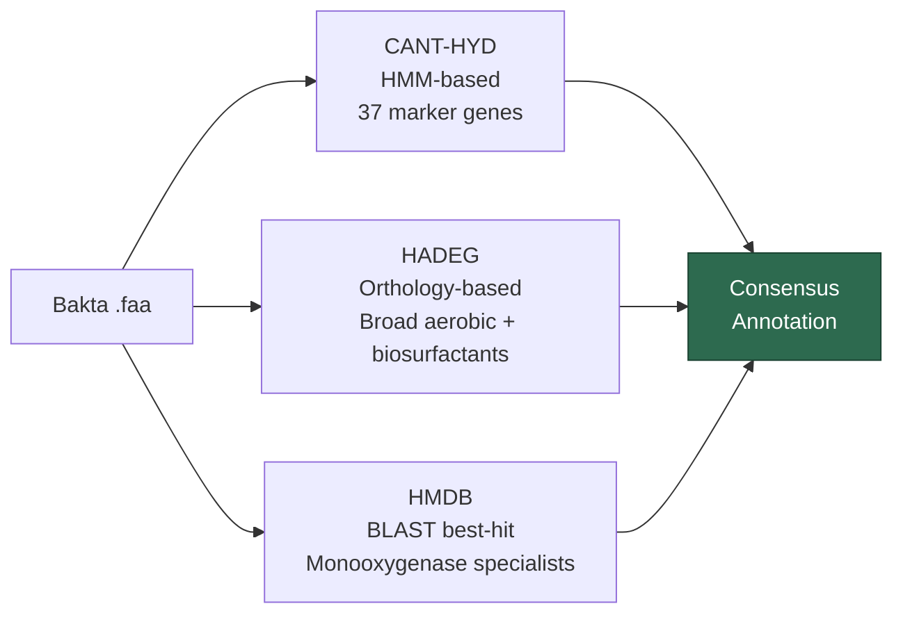
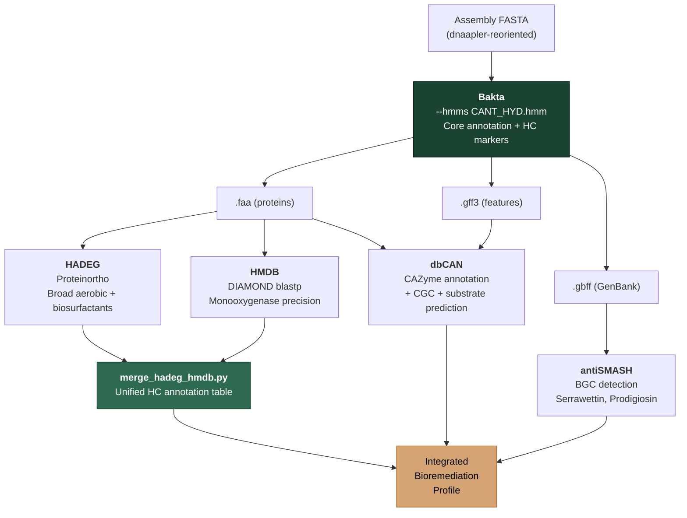

# Specialized Annotation Strategy Review: Hunting Hydrocarbonoclastics & Biosurfactant Engines in *Serratia nematodiphila*

## 1. Your Bakta Command — Verdict: Excellent ✅

Your C14 command is production-grade. Every flag serves a clear purpose and there are no conflicts. One brief note:

> [!TIP]
> You didn't include `--strain`. Consider adding `--strain C1.4` (or your actual isolate ID) so the GenBank/GFF source features carry the full taxonomic lineage down to strain level. This matters for NCBI submission and for distinguishing isolates in comparative genomics later.

---

## 2. Your Three-Database Strategy: CANT-HYD + HADEG + HMDB

This is a **genuinely strong, layered approach**. You're not just running one tool and calling it a day — you're triangulating with three databases that use fundamentally different detection methodologies. Here's exactly how they compare:

### Head-to-Head Comparison

| Dimension | **CANT-HYD** | **HADEG** | **HMDB** |
|:---|:---|:---|:---|
| **Method** | 37 profile HMMs (HMMER) | Orthology-based (Proteinortho) | Homology-based (BLAST/DIAMOND best-hit) |
| **Scope** | Aerobic **+ Anaerobic** (aliphatic & aromatic) | Aerobic only (alkanes, alkenes, aromatics, plastics, **biosurfactants**) | Aerobic only (**monooxygenases** exclusively) |
| **Gene count** | 37 marker genes | Broader (experimentally validated enzymes + pathways) | 38 genes encoding 11 monooxygenases |
| **Evidence basis** | Literature + phylogenetic curation | **Experimentally validated** sequences only | Curated + homologous background noise set (10,095 seqs) |
| **False positive control** | Trusted cutoffs (TC) in HMM profiles | Depends on Proteinortho identity/connectivity thresholds | Built-in background set of non-hydrocarbon monooxygenases |
| **Unique strength** | Only one covering **anaerobic** pathways | **Widest aerobic coverage** + biosurfactant genes | **Highest specificity** for monooxygenases |
| **Biosurfactant coverage** | ❌ No | ✅ Yes (srfA, rhlA/B, etc.) | ❌ No |

### Why This Combination Works



> [!IMPORTANT]
> **The three tools are NOT redundant — they are complementary by design:**
> - **CANT-HYD** (via Bakta `--hmms`): Catches the broadest marker set including anaerobic pathways. Acts as your **first-pass screen** directly embedded into annotation.
> - **HADEG**: Casts the widest aerobic net and is the **only one of the three** that covers biosurfactant production genes (serrawettins, rhamnolipids, surfactin-like). Critical for your biosurfactant angle.
> - **HMDB**: Acts as a **precision layer** specifically for monooxygenases. Its built-in background noise set of 10,095 non-hydrocarbon monooxygenase homologs means it has the lowest false-positive rate for this enzyme class.

### Overlap and Gaps

- **Overlap zone**: Aerobic alkane hydroxylases (e.g., AlkB, CYP153) and ring-hydroxylating dioxygenases will be detected by all three. This is *desirable* — concordance across methods = high confidence.
- **CANT-HYD only**: Anaerobic pathways (benzylsuccinate synthase, alkylsuccinate synthase, etc.). Less relevant for *Serratia* but good to have as a negative control.
- **HADEG only**: Biosurfactant synthesis genes, plastic degradation enzymes, and some peripheral aerobic pathway genes.
- **HMDB only**: Subtle monooxygenase variants that might fall below HMM thresholds but are caught by the background-aware BLAST strategy.

---

## 3. Merging HADEG and HMDB Results

> [!NOTE]
> There is **no existing off-the-shelf tool** that merges HADEG and HMDB outputs automatically. You need a custom integration step. But the good news is: both tools produce simple tabular outputs that are straightforward to join.

### Output Formats

- **HADEG** → Proteinortho `.proteinortho.tsv` — columns include your query protein IDs and their orthologous matches in the HADEG reference set, plus the HADEG functional category (alkane degradation, biosurfactant, etc.)
- **HMDB** → BLAST/DIAMOND tabular output (outfmt 6) — columns include query ID, subject ID, % identity, e-value, bitscore, plus the HMDB functional annotation (monooxygenase class, substrate)

### Merge Strategy

The common key for merging is the **protein sequence ID** from your Bakta `.faa` file. Both HADEG and HMDB annotate _your_ proteins, so you can perform a full outer join on the protein ID to create a unified view:

```
┌─────────────┬──────────────────────┬──────────────────────┐
│ Protein ID  │ HADEG Annotation     │ HMDB Annotation      │
├─────────────┼──────────────────────┼──────────────────────┤
│ C14NMZ_00005│ alkB (alkane deg.)   │ AlkB (C5-C16 alkane) │  ← Concordant hit
│ C14NMZ_00135│ rhlA (biosurfactant) │ —                    │  ← HADEG-only
│ C14NMZ_00280│ —                    │ pBMO (propane mono.) │  ← HMDB-only  
│ C14NMZ_00420│ nahAc (aromatic)     │ NDO (naphthalene)    │  ← Concordant hit
└─────────────┴──────────────────────┴──────────────────────┘
```

### Practical Python Script

```python
#!/usr/bin/env python3
"""
merge_hadeg_hmdb.py
Merge HADEG (Proteinortho) and HMDB (DIAMOND/BLAST) results
into a unified hydrocarbon degradation annotation table.
"""

import pandas as pd
import argparse

def parse_hadeg(proteinortho_tsv, mapping_tsv):
    """
    Parse HADEG Proteinortho output + HADEG category mapping.
    proteinortho_tsv: raw Proteinortho output
    mapping_tsv:      HADEG gene → category mapping (from HADEG repo)
    """
    po = pd.read_csv(proteinortho_tsv, sep="\t")
    # The last column(s) contain your query protein IDs
    # Extract hits where your proteome column is not '*'
    # Adapt column name to match your Proteinortho run
    query_col = [c for c in po.columns if "C14_NMZ" in c or "your_proteome" in c][0]
    hadeg_col = [c for c in po.columns if "HADEG" in c.upper()][0]
    
    hits = po[po[query_col] != "*"][[query_col, hadeg_col]].copy()
    hits.columns = ["protein_id", "hadeg_ortholog"]
    
    # Map HADEG orthologs to functional categories
    mapping = pd.read_csv(mapping_tsv, sep="\t")
    hits = hits.merge(mapping, left_on="hadeg_ortholog", right_on="gene_id", how="left")
    hits = hits.rename(columns={"category": "hadeg_category", "pathway": "hadeg_pathway"})
    
    return hits[["protein_id", "hadeg_ortholog", "hadeg_category", "hadeg_pathway"]]


def parse_hmdb(diamond_tsv):
    """
    Parse HMDB DIAMOND/BLAST outfmt6 results.
    Expected columns: qseqid sseqid pident length mismatch gapopen 
                      qstart qend sstart send evalue bitscore
    """
    cols = ["protein_id", "hmdb_hit", "pident", "length", "mismatch",
            "gapopen", "qstart", "qend", "sstart", "send", "evalue", "bitscore"]
    df = pd.read_csv(diamond_tsv, sep="\t", header=None, names=cols)
    
    # Keep best hit per query
    best = df.sort_values("bitscore", ascending=False).drop_duplicates("protein_id", keep="first")
    
    return best[["protein_id", "hmdb_hit", "pident", "evalue", "bitscore"]]


def merge_results(hadeg_df, hmdb_df):
    """Full outer join on protein_id."""
    merged = pd.merge(hadeg_df, hmdb_df, on="protein_id", how="outer")
    
    # Flag concordance
    merged["concordant"] = merged["hadeg_ortholog"].notna() & merged["hmdb_hit"].notna()
    merged["source"] = merged.apply(
        lambda r: "both" if r["concordant"]
                  else ("HADEG" if pd.notna(r["hadeg_ortholog"]) else "HMDB"),
        axis=1
    )
    return merged.sort_values("protein_id")


def main():
    parser = argparse.ArgumentParser(description="Merge HADEG + HMDB annotations")
    parser.add_argument("--hadeg", required=True, help="Proteinortho output TSV")
    parser.add_argument("--hadeg-map", required=True, help="HADEG gene-category mapping TSV")
    parser.add_argument("--hmdb", required=True, help="DIAMOND/BLAST outfmt6 TSV")
    parser.add_argument("-o", "--output", default="merged_hydrocarbon_annotations.tsv")
    args = parser.parse_args()
    
    hadeg = parse_hadeg(args.hadeg, args.hadeg_map)
    hmdb = parse_hmdb(args.hmdb)
    merged = merge_results(hadeg, hmdb)
    
    merged.to_csv(args.output, sep="\t", index=False)
    
    # Summary
    print(f"{'='*60}")
    print(f"Merged Hydrocarbon Degradation Annotation Summary")
    print(f"{'='*60}")
    print(f"Total annotated proteins : {len(merged)}")
    print(f"  HADEG-only             : {(merged['source'] == 'HADEG').sum()}")
    print(f"  HMDB-only              : {(merged['source'] == 'HMDB').sum()}")
    print(f"  Concordant (both)      : {merged['concordant'].sum()}")
    print(f"{'='*60}")
    print(f"Output written to: {args.output}")


if __name__ == "__main__":
    main()
```

Usage:
```bash
python merge_hadeg_hmdb.py \
  --hadeg proteinortho_output.tsv \
  --hadeg-map HADEG_gene_categories.tsv \
  --hmdb diamond_hmdb_results.tsv \
  -o C14_merged_hydrocarbon_annotations.tsv
```

---

## 4. antiSMASH + dbCAN: The BGC & CAZyme Layer

### antiSMASH — What to Expect for *Serratia nematodiphila*

antiSMASH will likely detect these BGC families in your genome:

| Expected BGC | Type | Relevance |
|:---|:---|:---|
| **Prodigiosin** (`pig` cluster) | PKS/NRPS hybrid | Red pigment, known antimicrobial — *Serratia* signature |
| **Serrawettin W1/W2** (`swrW`/`swrA`) | NRPS | **Lipopeptide biosurfactants** — directly relevant to your biosurfactant angle |
| Siderophore clusters | NRPS | Iron acquisition — common in environmental isolates |
| Aryl polyene | Type III PKS | Membrane-associated pigment |

> [!TIP]
> antiSMASH will classify serrawettin clusters generically as "NRPS" or "NRPS-like". Use **KnownClusterBlast** (enabled by default) to match against MIBiG entries. Look specifically for hits to **BGC0001274** (serrawettin W1) and **BGC0000426** (serrawettin W2). These are your biosurfactant smoking guns.

### dbCAN — Strategic Value

While CAZymes aren't the first thing you think of for hydrocarbon degradation, dbCAN adds value here because:

1. **Biofilm EPS degradation/synthesis**: CAZymes involved in exopolysaccharide metabolism are relevant to biofilm formation, which is a key mechanism *Serratia* uses to colonize hydrocarbon-contaminated surfaces.
2. **CGC Finder**: The CAZyme Gene Cluster module can reveal operonic organization of carbohydrate-processing machinery, which can hint at substrate specialization.

---

## 5. Complete Annotation Pipeline Overview



---

## 6. Summary & Recommendations

Your strategy is **methodologically sound and well-layered**. You are:

1. ✅ Embedding CANT-HYD directly into Bakta for first-pass HC marker detection
2. ✅ Using HADEG for the broadest aerobic coverage + the **only** biosurfactant detection layer among the three
3. ✅ Using HMDB as a precision tool for monooxygenase confidence
4. ✅ Adding antiSMASH for BGC-level biosurfactant cluster detection (serrawettins)
5. ✅ Adding dbCAN for CAZyme context (biofilm/EPS machinery)

> [!IMPORTANT]
> **The one thing you must build yourself** is the HADEG + HMDB merge step. The Python script above gives you a production-ready starting point. The merge key is simply the protein ID from Bakta's `.faa` output, which both downstream tools annotate against.
